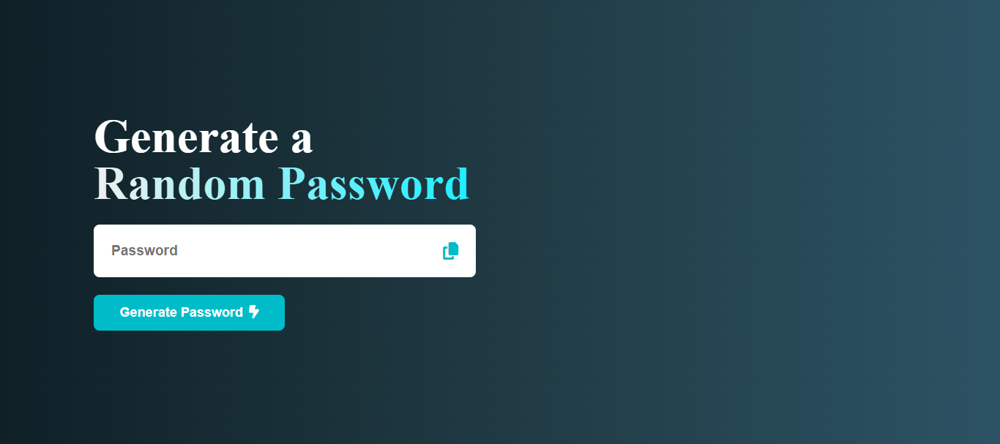

# 🔐 Random Password Generator

A beginner-friendly project built with **HTML, CSS, and JavaScript** that generates strong, secure random passwords with a single click. Perfect for practicing DOM manipulation and JavaScript logic.

---

## 📸 Preview

  

---

## ✨ Features

- ✅ Generates strong, random passwords instantly  
- ✅ Supports uppercase, lowercase, numbers, and symbols  
- ✅ One-click password copy to clipboard  
- ✅ Clean and responsive UI  
- ✅ Beginner-friendly code and structure

---

## 📁 Technologies Used

- **HTML5**
- **CSS3**
- **JavaScript (Vanilla)**

---

## 💡 What You’ll Learn

- DOM manipulation in JavaScript
- Event handling and user input
- Password generation logic using character sets
- Copy-to-clipboard functionality
- Clean UI design and responsiveness

---

## 📂 Folder Structure

random-password-generator/

├── index.html

├── style.css

├── script.js

└── screenshot.png

---

## 🧠 Use Case

Use this app to quickly generate strong passwords for better online security or as a learning project to understand the basics of **JavaScript logic + UI interaction**.

---

## 🌐 Connect With Me

📧 Email: [talhastl64@gmail.com](talhastl64@gmail.com)  
📷 YouTube: [DevCraft Projects](https://www.youtube.com/@devcraftprojects)  
🐱 GitHub: [@Syed-Muhammad-Talha](https://github.com/Syed-Muhammad-Talha)

---

## 🏷️ Tags

`#html` `#css` `#javascript` `#random-password` `#frontendproject` `#beginner` `#webdevelopment`

---

## 📄 License

This project is open-source and free to use.

